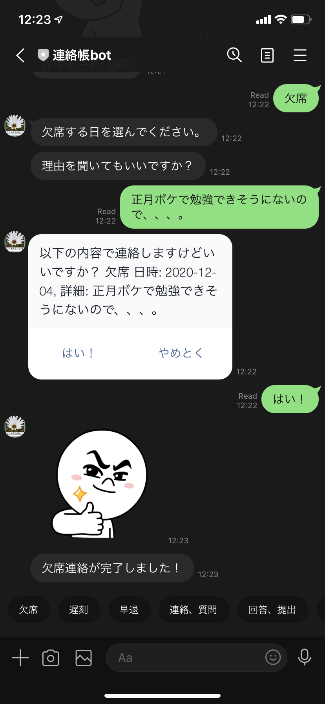

# cc16-project.polyglottal

This was created during my time as a student at Code Chrysalis.
This project is to learn new language and create an app with that language within 5 days,
and Python is my choice.

### Technologies

- PyTorch
- NLTK
- Flask
- Python
- LINE Messaging API
- Mailjet SMTP
- Firestore (Datasoter mode)
- Google Cloud Run
- Docker

## れんらくちょう bot (Renrakucho-bot)

### What is れんらくちょう(Renrakucho)?

れんらくちょう(Renrakucho) is a notebook and a communication tool between school teachers and parents. It's widely used in elementary shchools in Japan.
common usecase is like this. When a child wants to take an absence some day, parents write about it on their れんらくちょう(Renrakucho) and pass it to the child, the the child show it to the teacher. After confirming it, the teacher reply in the れんらくちょう(Renrakucho) and pass back to the child so the parents can check it.

### Problems

Normally the number of kids in 1 class room is about 30 - 40, and homeroom teacher is very busy. As you can imagine, writing for 40 れんらくちょう(Renrakucho) is so hard. Also, parents sometimes want to take an urgent absence or tardiness and call in the morning, but because all the teachers are busy, that phoning is often not taken. Moreover, childs often forgot to show the れんらくちょう(Renrakucho) to either teacher or parents. Anyway, this communication is obviously inefficient.

### Solution

To solve these problems, I tried to create a LINE chatbot that allows parents can send notices of absence, tardiness, leave-early, etc. to teachers. Reason why I chose LINE for the platform is LINE widespreaad in Japan and people are more familiar with that UI than any of other communication tools such as email.

### What you can do

To start:

- Register user(child) information --- You can choose English or Japanese mode!

Basic functions with menu:

- Send abcense(欠席) notice
- Send tardiness(遅刻) notice
- Send leave-early(早退) notice
- Send contact(連絡), question(質問) and consultation(相談)
- Send answer or submit a file --- still under construction!
- Send technical question or other comments

Fun function!:

- Chat with れんらくちょう bot (Renrakucho-bot) --- You can chat with the bot itself! This is implemented using Pytorch and NLTK. Only English is available.

Secret teacher functions --- can be available after typing a secret command "Teacher on":

- See notices of a day
- See all notices
- See all users
- Set email to send notices
- delete this user
- Turn off teacher mode

After sending any of above, a confirmation email will be sent to teachers.

![email]](./images/email.jpg)

### How to use

you can add れんらくちょう bot (Renrakucho-bot) as your friend in LINE by capturing the QR code below, and soon you'll be able to start.

![qr]](./images/qr.png)

Feel free to play aroud with it and give some advice, opinion or questions via other comments function!

Thank you for reading me.
